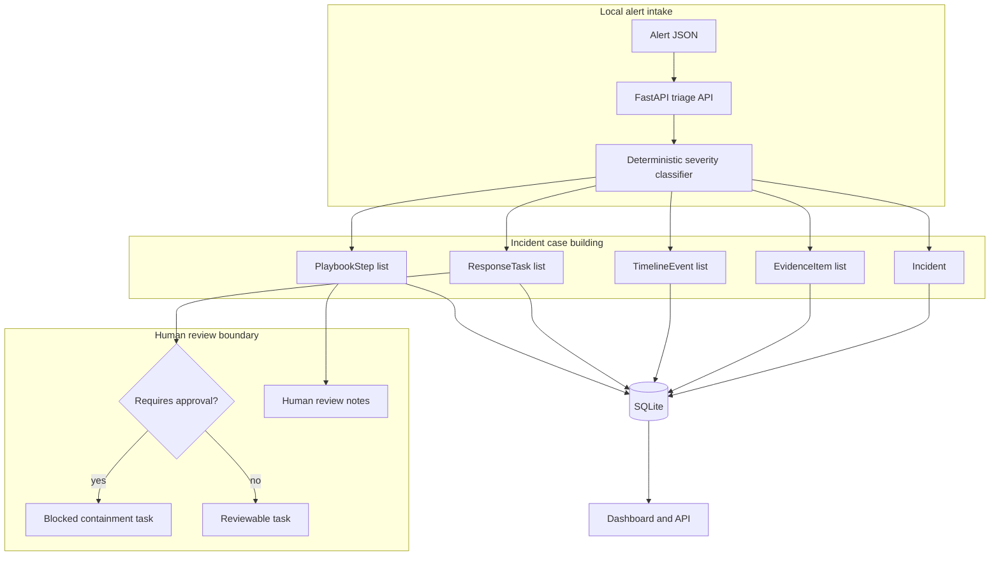

# Incident Response Copilot

Local-first incident response copilot for triage timelines, evidence, containment tasks, and reviewable playbooks.


The project models the workflow a security team needs after an alert arrives: create an incident, collect evidence, build a timeline, propose response tasks, and keep containment behind human review. It is deliberately offline and deterministic, so reviewers can run it without SIEM credentials or production access.

## What Works Today

- Deterministic incident fixtures spanning SIEM, Kubernetes, and malware-analysis signals.
- A live `POST /api/incidents/triage` endpoint that turns a local alert payload into an incident, evidence, timeline events, response tasks, and playbook steps.
- Evidence confidence, timeline events, containment tasks, approval gates, and playbook guidance.
- FastAPI API, SQLite storage, tests, CI, and polished local dashboard.

## Dashboard

The dashboard shows incident count, critical incidents, open response tasks, approval-required tasks, and evidence volume. The sidebar includes a local triage form with a sample production admin-login alert so reviewers can create a fresh incident and inspect the generated evidence/tasks immediately.

## Architecture



## API Surface

- `GET /api/health` - readiness check.
- `GET /api/summary` - incident, task, approval, and evidence counts.
- `GET /api/incidents` - incident list ordered by start time.
- `GET /api/incidents/{incident_id}` - incident, evidence, timeline, tasks, and playbook.
- `POST /api/incidents/triage` - create a new local incident from an alert payload.
- `POST /api/demo/reset` - reset deterministic demo data.

Example triage request:

```json
{
  "title": "Suspicious production admin login spike",
  "signal_source": "siem.alert",
  "description": "Multiple failed admin logins followed by a successful production login from a new ASN",
  "metadata": {
    "environment": "production",
    "failed_logins": 37,
    "asset": "admin-portal"
  }
}
```

The copilot creates a high-severity incident, evidence records, timeline entries, approval-gated containment tasks, and reviewable playbook steps.

## Triage Logic

The classifier is intentionally deterministic and easy to review:

- Malware, ransomware, exfiltration, callbacks, and credential dumps become critical.
- Failed admin logins, production access, and privilege language become high severity.
- Kubernetes egress, policy gaps, degraded metadata, and suspicious low-context signals become medium severity.
- Low-confidence informational alerts remain low severity.
- High and critical incidents generate approval-gated containment tasks.
- Kubernetes/egress incidents add a NetworkPolicy dry-run task.

## Quick Start

```bash
uv run --extra dev pytest
uv run incident-response-copilot
```

Open `http://127.0.0.1:8060` and try the sample alert in the triage panel.

## Development

```bash
uv run --extra dev ruff check src tests
uv run --extra dev ruff format --check src tests
uv run python -m compileall -q src tests
uv run --extra dev pytest tests/ --cov=incident_response_copilot --cov-report=term-missing
```

## Current Limits

This is a local portfolio incident workspace. Recommendations are reviewable guidance, not automated production containment. It does not connect to a live SIEM, SOAR, EDR, ticketing system, or cloud control plane. Real integrations, authentication, signed approvals, and live evidence ingestion would be the next production steps.
