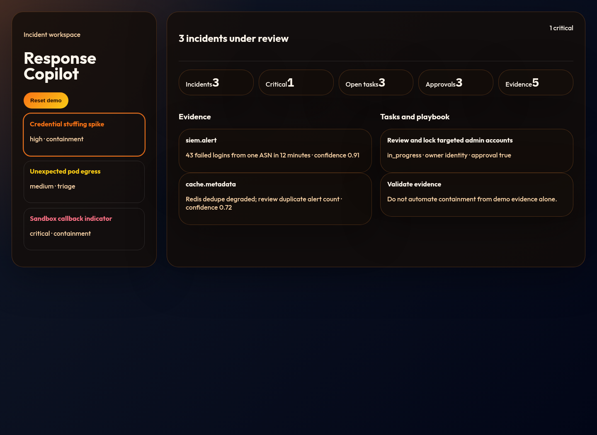
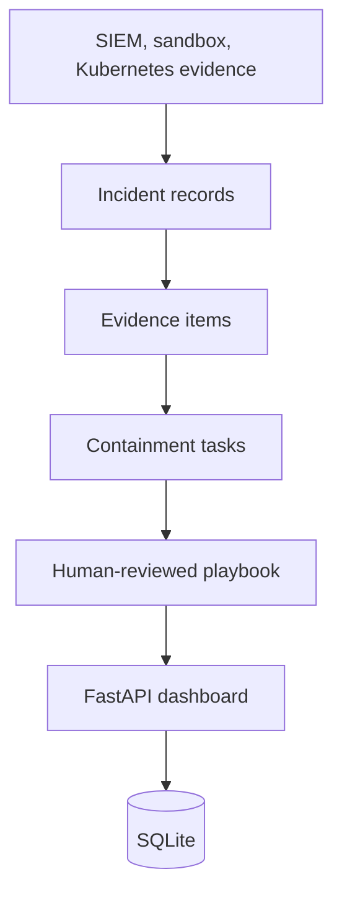

# Incident Response Copilot

Local-first incident response copilot for triage timelines, evidence, containment tasks, and reviewable playbooks.





## What Works Today

- Deterministic incident fixtures spanning SIEM, Kubernetes, and malware-analysis signals.
- Evidence confidence, timeline events, containment tasks, approval gates, and playbook guidance.
- FastAPI API, SQLite storage, tests, CI, and polished local dashboard.

## Quick Start

```bash
uv run --extra dev pytest
uv run incident-response-copilot
```

Open `http://127.0.0.1:8060`.

## Current Limits

This is a local portfolio incident workspace. Recommendations are reviewable guidance, not automated production containment.
