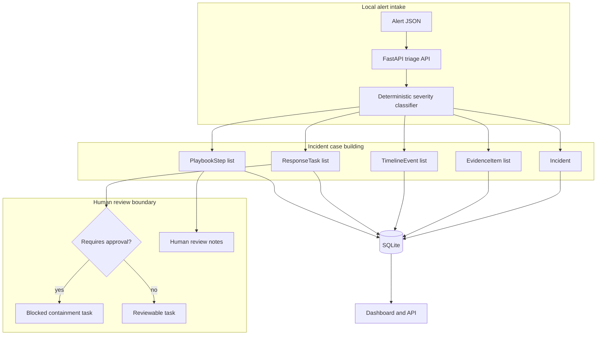

# Architecture

The copilot models incident workflow coordination without touching production systems.

## Runtime Flow

1. A local alert payload is submitted to `POST /api/incidents/triage`.
2. FastAPI validates the payload with Pydantic.
3. The repository infers severity from explicit hints, source text, metadata, and deterministic keyword rules.
4. The app creates an incident, evidence items, timeline events, response tasks, and playbook steps.
5. High and critical incidents keep containment behind human approval tasks.
6. The dashboard and read APIs expose the reviewable incident workspace.

## Boundary Choices

The app does not perform real containment, call a SIEM, or modify cloud/Kubernetes resources. The hiring signal is local incident modeling, evidence tracking, approval boundaries, and deterministic tests. Production hardening would add identity, signed approvals, ticketing/SOAR integrations, and live evidence ingestion.
