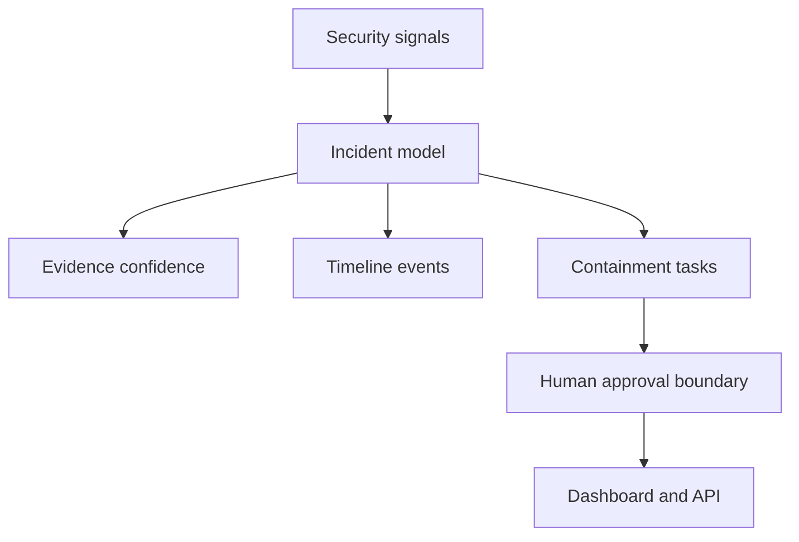

# Architecture

```mermaid
flowchart TB
    Signals[Security signals] --> Incidents[Incident model]
    Incidents --> Evidence[Evidence confidence]
    Incidents --> Timeline[Timeline events]
    Incidents --> Tasks[Containment tasks]
    Tasks --> Review[Human approval boundary]
    Review --> Dashboard[Dashboard and API]
```

The copilot models incident workflow coordination without touching production systems.
